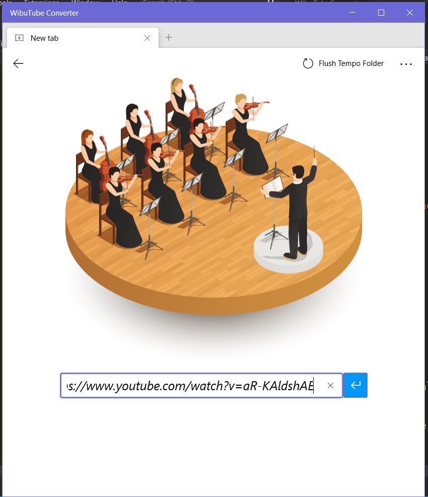
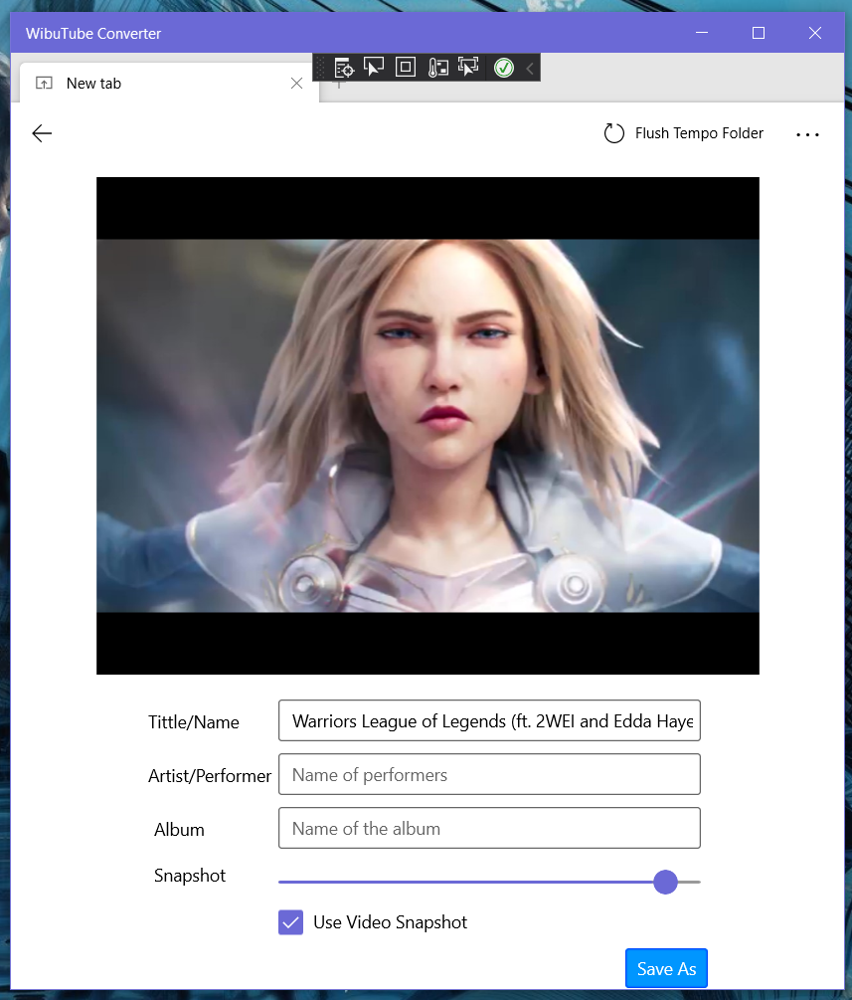
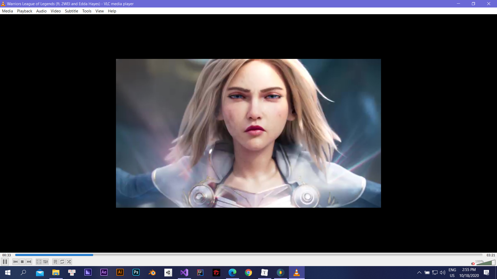
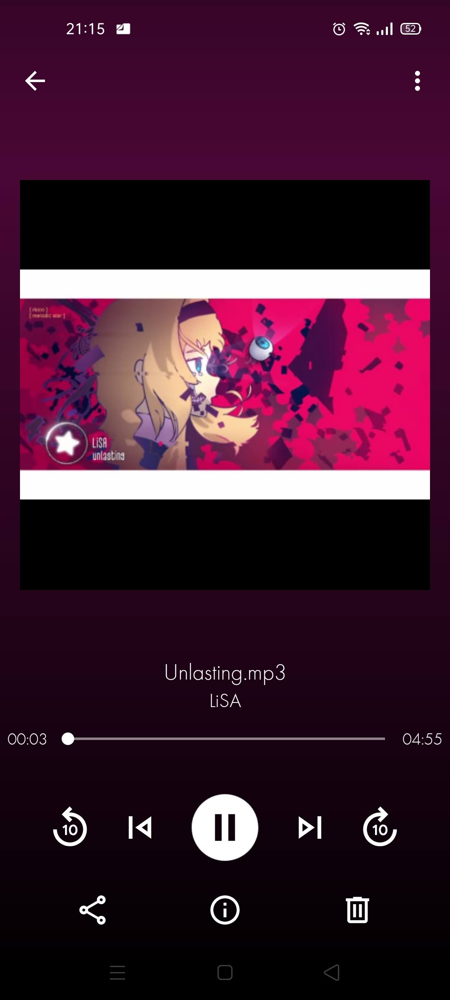
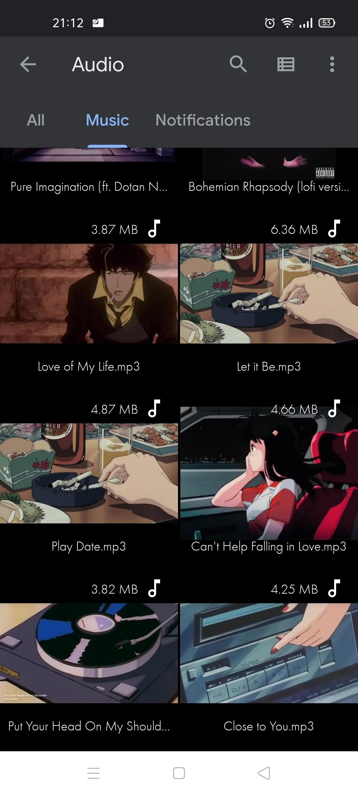
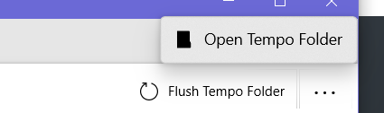
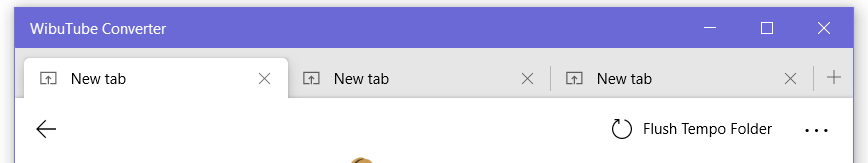

# WibuTube Converter

<a href="https://github.com/tarzanchemgio/WibuTubeConverter/releases" rel="">Latest Release x64</a>

An UWP app that downloads YouTube video and converts into Mp3. Do you love Nightcore? Want to capture the most epic moment of the clip?

Just simply paste the URL and grab your waifu!!

This app provide a few functionalities that helps your song look nice. Say goodbye to retard auto-naming, unknown artist, unknown album.. Well, there’re no excuses in case you don’t know artist or album name 😂😂

 <em>Result file was opened in VLC. Groove Music sometimes doesn’t present correctly)</em> 

 <em> (How it look like when play in mobile device) </em> 

## Additional Information

### Temporary Folder

Downloaded videos and previewed snapshots are stored in `Tempo Folder` . They will be automatically removed when app closed. Manually press `Flush Tempo Folder` does the same.

Try open `Tempo Folder` and see how deep you might rolling into (☞ﾟヮﾟ)☞

### New Tab

Convert multiple video in multiple tabs at once. We spare no RAM  ¯\\_(ツ)_/¯

